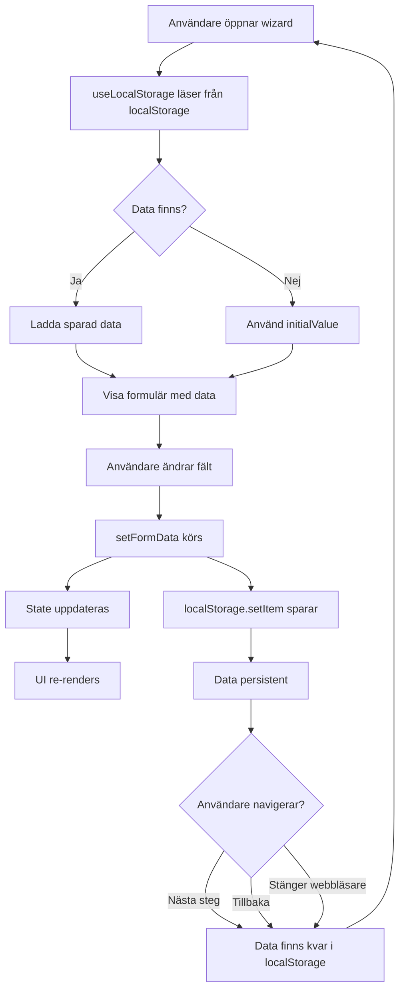

# LocalStorage Implementation - Onboarding Wizard

## Översikt

Detta dokument beskriver implementationen av localStorage för att bevara formulärdata i onboarding-guiden mellan navigeringar och sessioner.

**Datum skapad:** 2025-10-31  
**Senast uppdaterad:** 2025-10-31  
**Status:** ✅ Implementerad (Steg 1-3 färdiga, Steg 4 EDD återstår)

---

## Problembeskrivning

**Ursprungligt problem:**
- Formulärdata försvann när användare navigerade mellan wizard-steg
- Ingen persistens vid siduppdatering eller om användare stängde webbläsaren
- Dålig användarupplevelse - användare måste fylla i allt från början vid varje återbesök

**Krav:**
- Automatisk sparning av formulärdata vid varje ändring
- Automatisk laddning av data vid komponentens mount
- Data ska bevaras mellan sessioner (över webbläsarstängning)
- Varje wizard-steg ska ha sin egen isolerade localStorage-key
- Möjlighet att rensa all wizard-data vid behov (t.ex. logout)

---

## Arkitektur

### Custom Hook: `useLocalStorage`

**Fil:** `src/hooks/useLocalStorage.js`

```javascript
import { useState, useEffect } from 'react';

export function useLocalStorage(key, initialValue) {
  // State initialiseras med värde från localStorage eller initialValue
  const [storedValue, setStoredValue] = useState(() => {
    try {
      const item = window.localStorage.getItem(key);
      return item ? JSON.parse(item) : initialValue;
    } catch (error) {
      console.error(`Error loading ${key} from localStorage:`, error);
      return initialValue;
    }
  });

  // Uppdatera localStorage när state ändras
  const setValue = (value) => {
    try {
      const valueToStore = value instanceof Function ? value(storedValue) : value;
      setStoredValue(valueToStore);
      window.localStorage.setItem(key, JSON.stringify(valueToStore));
    } catch (error) {
      console.error(`Error saving ${key} to localStorage:`, error);
    }
  };

  // Synka mellan tabs/windows
  useEffect(() => {
    const handleStorageChange = (e) => {
      if (e.key === key && e.newValue) {
        setStoredValue(JSON.parse(e.newValue));
      }
    };
    window.addEventListener('storage', handleStorageChange);
    return () => window.removeEventListener('storage', handleStorageChange);
  }, [key]);

  return [storedValue, setValue];
}

// Utility för att rensa all wizard-data
export function clearWizardData() {
  localStorage.removeItem('onboarding-wizard-steg1');
  localStorage.removeItem('onboarding-wizard-steg2');
  localStorage.removeItem('onboarding-wizard-steg3');
  localStorage.removeItem('onboarding-wizard-steg4');
}
```

### Funktionalitet

1. **Auto-load:** Data laddas automatiskt från localStorage vid komponentens mount
2. **Auto-save:** Data sparas automatiskt vid varje state-uppdatering
3. **Cross-tab sync:** Ändringar i en flik synkas till andra öppna flikar
4. **Error handling:** Graceful fallback till initialValue vid localStorage-fel
5. **JSON serialization:** Automatisk JSON.stringify/parse för objekt

---

## LocalStorage Keys

Varje wizard-steg har sin egen unika key:

| Steg | Key | Status |
|------|-----|--------|
| Steg 1 - Grundläggande info | `onboarding-wizard-steg1` | ✅ Implementerad |
| Steg 2 - Geografisk risk | `onboarding-wizard-steg2` | ✅ Implementerad |
| Steg 3 - Betalningsflöden | `onboarding-wizard-steg3` | ✅ Implementerad |
| Steg 4 - EDD (Enhanced Due Diligence) | `onboarding-wizard-steg4` | ⏳ Planerad |

---

## Implementation per Steg

### Steg 1: Grundläggande Information
**Fil:** `src/components/Slides/RiskFragorSlide.jsx`

```javascript
import { useLocalStorage } from '../../hooks/useLocalStorage';

export default function RiskFragorSlide({ onNext }) {
  const [formData, setFormData] = useLocalStorage('onboarding-wizard-steg1', {
    foretag: '',
    orgnummer: '',
    vd: '',
    vdPersonnummer: '',
    verkligHuvudman: '',
    verkligHuvudmanPersonnummer: '',
    pep: '',
    pepRelation: '',
  });
  
  // Använd formData och setFormData som vanlig useState
  // ...
}
```

**Dataobjekt:**
- `foretag`: Företagsnamn (autocomplete från Bolagsverket)
- `orgnummer`: Organisationsnummer
- `vd`: VD:s namn
- `vdPersonnummer`: VD:s personnummer
- `verkligHuvudman`: Verklig huvudman
- `verkligHuvudmanPersonnummer`: Personnummer verklig huvudman
- `pep`: Politiskt exponerad person (ja/nej)
- `pepRelation`: Befattning/relation om PEP

---

### Steg 2: Geografisk Risk & Affärsrelationer
**Fil:** `src/components/Slides/RiskFragorSteg2Slide.jsx`

```javascript
const [formData, setFormData] = useLocalStorage('onboarding-wizard-steg2', {
  blockA_question1: '',
  blockA_question2: '',
  blockA_question3: '',
  blockB_question4: '',
  blockC_question5: '',
  blockC_question6: '',
});
```

**Struktur:**
- **BLOCK A:** Geografisk exponering
  - `blockA_question1`: Utländska kunder (ja/nej/vet-ej)
  - `blockA_question2`: Omsättningsandel utland (<10%, 10-30%, >30%)
  - `blockA_question3`: Typ av samarbete (dropdown)
- **BLOCK B:** Leverantörer
  - `blockB_question4`: Leverantörer utomlands (ja/nej/vet-ej)
- **BLOCK C:** Kunder & bankkonton
  - `blockC_question5`: Kunder (endast-sverige/blandad/huvudsakligen-utland)
  - `blockC_question6`: Utländska bankkonton (ja/nej)

**Info buttons:**
- Alla 6 frågor har info-knappar (absolute top-4 right-4)
- Expandable inline med `getLegalTextsForQuestion('steg2', 'blockX_questionY')`

---

### Steg 3: Betalningsflöden & Transaktionsmönster
**Fil:** `src/components/Slides/RiskFragorSteg3Slide.jsx`

```javascript
const [formData, setFormData] = useLocalStorage('onboarding-wizard-steg3', {
  betalmetoder: {
    bankoverföring: false,
    kortbetalning: false,
    faktura: false,
    kontanter: false,
    kryptovaluta: false,
  },
  kontanterAndel: '',
  kontanthanteringstillstand: '',
  storaTransaktioner: '',
  tredjepartsbetalningar: '',
  utlandskaOverforingar: '',
  utlandskaLander: '',
});
```

**Struktur:**
- **Question 1:** Betalningsmetoder (checkboxes för multiple selection)
- **Question 2:** Kontanterandel (conditional - visas endast om kontanter vald)
  - Dropdown: <5%, 5-20%, 20-50%, >50%
  - Varning visas om ≥20%
- **Question 3:** Stora transaktioner >150k kr (ja/ibland/nej)
- **Question 4:** Tredjepartsbetalningar (ja/nej)
- **Question 5:** Utländska överföringar (ja-regelbundet/ja-ibland/nej)
  - Text input för länder (conditional)

**Riskbedömning:**
- 🔴 Hög risk: Kontanter, kryptovaluta, tredjepartsbetalningar
- 🟡 Medel risk: Kontanter 20-50%
- ⚠️ Automatisk flaggning vid högrisk-alternativ

**Info buttons:**
- Alla 5 frågor har info-knappar (absolute top-4 right-4)
- Expandable inline med `getLegalTextsForQuestion('steg3', 'question1-5')`

---

### Steg 4: Enhanced Due Diligence (EDD)
**Fil:** `src/components/Slides/RiskFragorSteg4Slide.jsx`

**Status:** ⏳ Planerad (ännu ej implementerad)

**Planerad struktur:**
```javascript
const [formData, setFormData] = useLocalStorage('onboarding-wizard-steg4', {
  affarsforbindelse: '',
  startkapital: '',
  dokumentation: '',
  transaktionsmönster: '',
  verkligaHuvudman: '',
  storaInbetalningar: '',
});
```

**6 EDD-frågor (från Onboarding_app_ny.tex rad 2016-2108):**
1. Affärsförbindelsens syfte (textarea)
2. Startkapital och finansiering (textarea)
3. Dokumentation av affärsrelationer (textarea)
4. Ovanliga transaktionsmönster (textarea)
5. Verkliga huvudmän fördjupad (textarea)
6. Stora inbetalningar (textarea)

**Conditional rendering:**
- Visas endast om `requiresEDD: true` från backend
- Triggers: Högriskland, >30% utlandsomsättning, kontanter >20%, krypto, tredjepartsbetalningar, PEP

---

## UI Pattern: Info Buttons

**Konsekvent pattern för alla frågor (Steg 2-3):**

```jsx
<div className="p-4 bg-gray-50 rounded-lg border border-gray-200 relative">
  {/* Info button - absolute positioned */}
  <button
    onClick={() => toggleInfo('questionId')}
    className="absolute top-4 right-4 text-brand-600 hover:text-brand-700 transition-colors"
    aria-label="Visa lagtext"
  >
    <Info className="w-5 h-5" />
  </button>

  {/* Question content */}
  <label className="block text-sm font-medium text-brand-800 mb-2">
    Fråga text här
  </label>
  
  {/* Input fields */}
  {/* ... */}

  {/* Expandable lagtext */}
  {expandedInfo.questionId && (
    <div className="mt-4 p-3 bg-white border border-brand-300 rounded-lg text-xs space-y-2">
      {getLegalTextsForQuestion('stegX', 'questionY').map((lagtext, idx) => (
        <div key={idx}>
          <p className="font-semibold text-brand-900">{lagtext.law}</p>
          <p className="text-gray-700 mt-1">{lagtext.shortText}</p>
          <p className="text-gray-500 italic mt-1">Referens: [{lagtext.id}]</p>
        </div>
      ))}
    </div>
  )}
</div>
```

**Required state:**
```javascript
const [expandedInfo, setExpandedInfo] = useState({});

const toggleInfo = (questionId) => {
  setExpandedInfo(prev => ({
    ...prev,
    [questionId]: !prev[questionId]
  }));
};
```

---

## Data Lifecycle



---

## Data Rensning

### Manuell rensning
```javascript
import { clearWizardData } from '../../hooks/useLocalStorage';

// Vid logout eller när användare vill börja om
const handleLogout = () => {
  clearWizardData();
  // ... övrig logout-logik
};
```

### Automatisk rensning
**Planerade triggers:**
- Vid framgångsrik slutförande av onboarding (POST till backend lyckades)
- Vid explicit "Avbryt onboarding"-knapp
- Vid logout
- Vid sessionsutgång (timeout)

---

## Säkerhetshänsyn

### Vad sparas
✅ **SÄKERT att spara:**
- Företagsnamn, organisationsnummer
- VD:s namn, personnummer
- Verklig huvudmans namn, personnummer
- Svarsalternativ från formulär (ja/nej, dropdowns)
- Land-information
- Betalningsmetoder

### Vad sparas INTE
❌ **FÅR INTE sparas:**
- Lösenord eller credentials
- API-tokens
- Känslig bankkontosinformation
- Kreditkortsnummer

### localStorage vs sessionStorage

**Valt:** `localStorage` (persistent över sessions)

**Anledning:**
- Användare kan stänga webbläsaren och fortsätta senare
- Bättre UX för långa formulär
- Data raderas inte vid tab-stängning

**Alternativ:** `sessionStorage` (endast under aktiv session)
- Mindre persistent, raderas när tab stängs
- Mer säkert om känsligare data hanteras
- Kan övervägas för framtida implementation

---

## Testing

### Manuella tester
- [x] Fyll i Steg 1 → navigera till Steg 2 → tillbaka till Steg 1 → data finns kvar
- [x] Fyll i formulär → stäng webbläsare → öppna igen → data finns kvar
- [x] Öppna två flikar → ändra i ena → data synkas till andra
- [x] Testa alla wizard-steg (Steg 1-3 testade)
- [ ] Testa clearWizardData() funktionalitet

### Edge cases
- [x] Tom initialValue → formulär startar tomt
- [x] localStorage fullt/blockerat → fallback till initialValue
- [x] Korrupt JSON i localStorage → error handling fångar upp
- [x] Ändra initialValue-struktur → gammal data överskrids

---

## Framtida Förbättringar

### Prioritet 1 (Nästa iteration)
- [ ] Implementera Steg 4 EDD med localStorage
- [ ] Lägg till `clearWizardData()` vid framgångsrik submission
- [ ] Auto-save indikator i UI (tex "Sparad ✓")

### Prioritet 2 (Framtida)
- [ ] Versionshantering av localStorage-schema
  - Ex: `{ version: 1, data: {...} }`
  - Migrationsstrategi vid strukturändringar
- [ ] TTL (Time To Live) för localStorage-data
  - Ex: radera data äldre än 30 dagar
- [ ] Kompression för stora datamängder
- [ ] Kryptering av känslig data i localStorage
- [ ] Backend-synk: Spara draft till databas var X:e minut

### Prioritet 3 (Nice to have)
- [ ] Undo/Redo funktionalitet
- [ ] localStorage quota monitoring
- [ ] Exportera/importera wizard-data (JSON-fil)
- [ ] Multi-language support för lagrade frågor

---

## Relaterade Dokument

- [CONFIG_STRUCTURE.md](./CONFIG_STRUCTURE.md) - Konfigurationsstruktur
- [VALIDATION_TESTS.md](./VALIDATION_TESTS.md) - Valideringstester
- [Onboarding_app_ny.tex](../../latex/Onboarding_app_ny.tex) - Fullständig spec
- [legalTexts.js](../../src/data/legalTexts.js) - Lagtext-mappningar

---

## Changelog

| Datum | Version | Beskrivning |
|-------|---------|-------------|
| 2025-10-31 | 1.0 | Initial implementation - useLocalStorage hook skapad |
| 2025-10-31 | 1.1 | Steg 1 implementerad med localStorage |
| 2025-10-31 | 1.2 | Steg 2 implementerad med localStorage + info buttons |
| 2025-10-31 | 1.3 | Steg 3 implementerad med localStorage + info buttons |
| TBD | 2.0 | Steg 4 EDD implementation (planerad) |

---

## Kontakt & Support

**Utvecklare:** Claude + Lasse  
**Projekt:** Celestial Onboarding App  
**Repository:** `karagiannis/react_tesning`  
**Branch:** `main`
