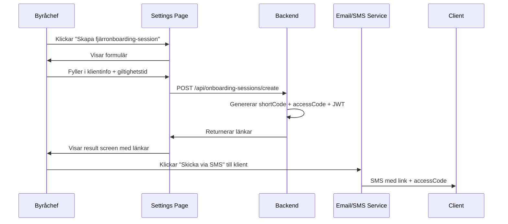
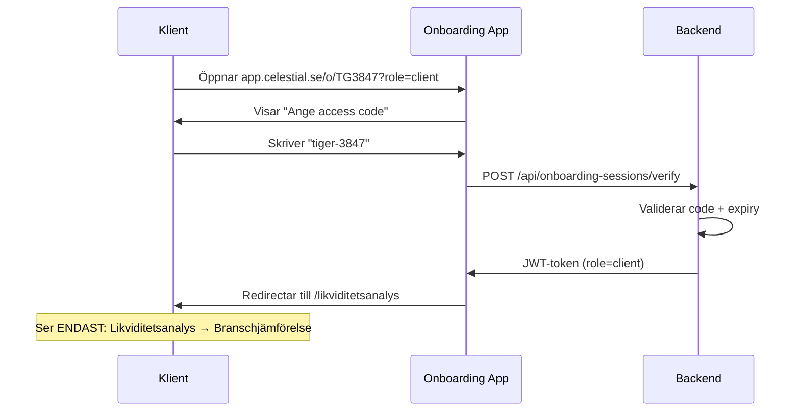
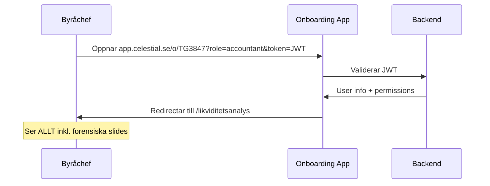

# Settings Page - Konstruktionsdokument

## Översikt

Settings-sidan för byråchefen med sidebar-navigation (inspirerad av Themesberg Dashboard). Här kan byråchefen hantera användare, skapa fjärronboarding-sessioner, och konfigurera byråinställningar.

**Datum skapad:** 2025-10-31  
**Senast uppdaterad:** 2025-10-31  
**Status:** 📝 Planerad (Dokumentation först, implementation senare i iteration)

---

## Sidebar Navigation

**Layout:** Themesberg-inspirerad sidebar med kategorier

```
┌─────────────────────────┬──────────────────────────────────┐
│  ⚙️ Inställningar       │  Huvudinnehåll                    │
│                         │                                   │
│  👤 Användare           │  [Aktivt innehåll baserat på val] │
│    ├─ Alla användare    │                                   │
│    ├─ Lägg till         │                                   │
│    └─ Roller            │                                   │
│                         │                                   │
│  🔗 Fjärronboarding     │                                   │
│    ├─ Aktiva sessioner  │                                   │
│    └─ Skapa ny session  │                                   │
│                         │                                   │
│  🏢 Byråinställningar   │                                   │
│    ├─ Företagsinfo      │                                   │
│    ├─ Prislista         │                                   │
│    └─ E-post/SMS        │                                   │
│                         │                                   │
│  🧾 Fakturering (mock)  │                                   │
│    ├─ Översikt          │                                   │
│    └─ Skapa faktura     │                                   │
│                         │                                   │
│  🔐 Säkerhet            │                                   │
│    └─ API-nycklar       │                                   │
└─────────────────────────┴──────────────────────────────────┘
```

---

## 1. Användare (från Themesberg)

### 1.1 Alla användare

**Syfte:** Lista alla användare i byrån (anställda)

**Kolumner:**
- Namn
- E-post
- Roll (Admin / Användare / Granskning)
- Status (Aktiv / Inaktiv / Väntande inbjudan)
- Senast inloggad
- Åtgärder (Redigera / Ta bort / Återaktivera)

**Funktioner:**
- Sök/filter på namn, e-post, roll
- Bulk-selection för massåtgärder
- Export till CSV

**Mock data (3-5 användare):**
```javascript
[
  { name: 'Anna Andersson', email: 'anna@revisionstockholm.se', role: 'Admin', status: 'active', lastLogin: '2025-10-30 14:23' },
  { name: 'Johan Svensson', email: 'johan@revisionstockholm.se', role: 'User', status: 'active', lastLogin: '2025-10-29 09:45' },
  { name: 'Maria Karlsson', email: 'maria@revisionstockholm.se', role: 'User', status: 'pending', lastLogin: null }
]
```

### 1.2 Lägg till användare (Themesberg-pattern)

**Modal/Form:**
```
┌─────────────────────────────────────────┐
│  Lägg till ny användare                  │
│                                          │
│  Förnamn: [_________________]            │
│  Efternamn: [_________________]          │
│  E-post: [_________________]             │
│                                          │
│  Roll: [▼ Välj roll]                     │
│    - Admin (full åtkomst)                │
│    - Användare (onboarding + klienter)   │
│    - Granskning (endast läsrättigheter)  │
│                                          │
│  [Skicka inbjudan]  [Avbryt]            │
└─────────────────────────────────────────┘
```

**Backend:**
```javascript
POST /api/users/invite
{
  firstName: "Erik",
  lastName: "Eriksson",
  email: "erik@revisionstockholm.se",
  role: "user",
  firmId: "firm-uuid-123"
}

// Response:
{
  userId: "user-uuid-456",
  invitationLink: "https://app.celestial.se/accept-invite?token=JWT_TOKEN",
  invitationCode: "TIGER3847",  // Alternativ access code
  expiresAt: "2025-11-07T12:00:00Z"  // 7 dagar
}
```

**E-post till ny användare:**
```
Hej Erik!

Du har blivit inbjuden till Celestial Onboarding App av Revision Stockholm AB.

Klicka här för att acceptera: [Länk]

Alternativt kan du gå till https://app.celestial.se/accept-invite 
och ange kod: TIGER3847

Inbjudan gäller i 7 dagar.

---
Celestial Onboarding App
```

### 1.3 Roller och behörigheter

| Roll | Onboarding | Klienter | Forensisk analys | Inställningar | Fakturering |
|------|-----------|----------|------------------|---------------|-------------|
| **Admin** | ✅ Alla | ✅ Alla | ✅ Alla | ✅ Full åtkomst | ✅ Alla |
| **Användare** | ✅ Skapa/redigera | ✅ Egna + tilldelade | ✅ Endast egna | ❌ Nej | ✅ Se egna |
| **Granskning** | ❌ Läs endast | ✅ Alla (läs) | ✅ Alla (läs) | ❌ Nej | ❌ Nej |

---

## 2. Fjärronboarding-sessioner

### 2.1 Skapa ny fjärronboarding-session

**Syfte:** Generera tidsbegränsade länkar för klient och byråchef

**Form:**
```
┌──────────────────────────────────────────────────┐
│  Skapa fjärronboarding-session                    │
│                                                   │
│  Klientföretag:                                   │
│    Namn: [Acme AB______________]                  │
│    Org.nr: [556123-4567________]                  │
│                                                   │
│  Giltighetstid:                                   │
│    [▼ 24 timmar]  (6h / 12h / 24h / 48h / 7 dagar)│
│                                                   │
│  Läge:                                            │
│    ⚪ Fysisk onboarding (klient + byrå tillsammans)│
│    ⦿ Fjärronboarding (separata datorer)           │
│                                                   │
│  [Skapa session]  [Avbryt]                       │
└──────────────────────────────────────────────────┘
```

**Backend:**
```javascript
POST /api/onboarding-sessions/create
{
  clientName: "Acme AB",
  orgNr: "556123-4567",
  mode: "remote",  // "remote" | "in-person"
  expiresIn: 24    // hours
}

// Response:
{
  sessionId: "uuid-abc123",
  shortCode: "TG3847",  // 6-char alphanumeric
  
  accountantLink: "https://app.celestial.se/o/TG3847?role=accountant&token=JWT_TOKEN",
  clientLink: "https://app.celestial.se/o/TG3847?role=client",
  clientAccessCode: "tiger-3847",  // word-1234 format
  
  createdAt: "2025-10-31T12:00:00Z",
  expiresAt: "2025-11-01T12:00:00Z",
  status: "active"
}
```

**Result Screen (efter skapande):**
```
┌──────────────────────────────────────────────────────────┐
│  ✅ Session skapad: Acme AB (556123-4567)                │
│                                                           │
│  📋 LÄNKAR & KODER                                        │
│                                                           │
│  🔗 För dig (byråchef):                                  │
│  https://app.celestial.se/o/TG3847?role=accountant       │
│  [Kopiera länk]  [Dela med kollegor via mejl]           │
│                                                           │
│  🔗 För klienten:                                        │
│  https://app.celestial.se/o/TG3847?role=client           │
│  Access code: tiger-3847                                  │
│  [Kopiera länk]  [Skicka via SMS]  [Skicka via mejl]    │
│                                                           │
│  ⏱️ Giltig till: 2025-11-01 kl. 12:00                   │
│  🔐 Status: Aktiv                                        │
│                                                           │
│  [Stäng]  [Skapa ny session]                             │
└──────────────────────────────────────────────────────────┘
```

### 2.2 Aktiva sessioner (lista)

**Tabell:**
| Klient | Org.nr | Läge | Access Code | Status | Skapad | Giltig till | Åtgärder |
|--------|--------|------|-------------|--------|--------|------------|----------|
| Acme AB | 556123-4567 | Fjärr | tiger-3847 | 🟢 Aktiv | 2025-10-31 12:00 | 2025-11-01 12:00 | [Kopiera länkar] [Avsluta] |
| Beta Corp | 559876-5432 | Fysisk | - | ✅ Slutförd | 2025-10-30 09:00 | 2025-10-31 09:00 | [Visa rapport] |
| Gamma Inc | 556234-9876 | Fjärr | lion-5612 | ⏰ Utgången | 2025-10-29 15:00 | 2025-10-30 15:00 | [Förnya] [Ta bort] |

**Status-badges:**
- 🟢 Aktiv (grön)
- ⏰ Utgången (grå)
- ✅ Slutförd (blå)
- ❌ Avbruten (röd)

**Funktioner:**
- Filter: Aktiva / Alla / Utgångna / Slutförda
- Sök på klientnamn eller org.nr
- Bulk-delete utgångna sessioner
- Export lista till CSV

---

## 3. Byråinställningar

### 3.1 Företagsinformation

**Form (CONFIG_STRUCTURE.md data):**
```
Byrånamn: [Revision Stockholm AB______________]
Org.nr:   [556789-1234_______________________]
Adress:   [Storgatan 1_______________________]
Postnr:   [11122____]  Ort: [Stockholm______]
Telefon:  [08-123 45 67_____________________]
E-post:   [info@revisionstockholm.se________]
Webbplats: [www.revisionstockholm.se_________]

[Spara ändringar]
```

**Backend:** Uppdaterar `/api/settings/firm-config`

### 3.2 Prislista (default pricing)

**Tabell (redigerbar):**
| Tjänst | Pris/år | Aktiv |
|--------|---------|-------|
| Bokföring och deklaration | 12 000 kr | ☑️ |
| Bokslut | 8 000 kr | ☑️ |
| Moms | 3 000 kr | ☑️ |
| Lön | 4 000 kr | ☑️ |
| Årsredovisning | 10 000 kr | ☑️ |
| Finansiell rapportering | 6 000 kr | ☐ |

**+ Lägg till egen tjänst** (custom pricing)

### 3.3 E-post och SMS-mallar

**Dropdown:** Välj mall
- Inbjudan till anställd
- Fjärronboarding-länk till klient
- Dokumentförfrågan
- Påminnelse om uppladdning
- Välkomstmail efter onboarding

**Editor:** (Rich text)
```
Hej {{client_name}}!

Välkommen till {{firm_name}}. 

För att påbörja din onboarding, klicka här:
{{onboarding_link}}

Access code: {{access_code}}

Länken är giltig till {{expires_at}}.

Med vänliga hälsningar,
{{accountant_name}}
{{firm_name}}
```

**Variabler:** `{{client_name}}`, `{{firm_name}}`, `{{onboarding_link}}`, etc.

---

## 4. Fakturering (Mock - Framtida feature)

### 4.1 Översikt

**KPI-kort:**
```
┌─────────────────┬─────────────────┬─────────────────┬─────────────────┐
│ Totalt i år     │ Förfallna       │ Pågående        │ Betalda         │
│ 1 450 000 kr    │ 45 000 kr       │ 280 000 kr      │ 1 125 000 kr    │
└─────────────────┴─────────────────┴─────────────────┴─────────────────┘
```

**Senaste fakturor:**
| Fakturanr | Klient | Belopp | Status | Förfallodatum | Åtgärd |
|-----------|--------|--------|--------|---------------|--------|
| 2025-001 | Acme AB | 15 000 kr | ⏰ Förfallen | 2025-10-15 | [Skicka påminnelse] |
| 2025-002 | Beta Corp | 22 000 kr | 🟡 Pågående | 2025-11-10 | [Visa] |
| 2025-003 | Gamma Inc | 18 000 kr | ✅ Betald | 2025-10-20 | [Kvitto] |

### 4.2 Skapa faktura (Mock UI)

**Form:**
```
┌────────────────────────────────────────────────────────┐
│  Skapa ny faktura                                       │
│                                                         │
│  Klient: [▼ Välj klient_____________]                  │
│                                                         │
│  Tjänster:                                             │
│  ☑️ Bokföring och deklaration  12 000 kr               │
│  ☑️ Bokslut                      8 000 kr               │
│  ☑️ Moms                         3 000 kr               │
│  ☐ Lön                           4 000 kr               │
│                                                         │
│  Rabatt: [0]% eller [___] kr                            │
│                                                         │
│  ──────────────────────────────────────────            │
│  Totalt (exkl. moms):           23 000 kr               │
│  Moms (25%):                     5 750 kr               │
│  ──────────────────────────────────────────            │
│  Att betala:                    28 750 kr               │
│                                                         │
│  Förfallodatum: [▼ 30 dagar] (10 / 20 / 30 / 60 dagar) │
│                                                         │
│  [Förhandsgranskning]  [Skapa faktura]  [Avbryt]      │
└────────────────────────────────────────────────────────┘
```

**PDF-output (mock):**
- Themesberg-inspirerad faktura-layout
- Byråns logotyp (om uppladdad)
- Alla företagsuppgifter från CONFIG_STRUCTURE
- Raduppdelning med tjänster
- Bankgiro/Plusgiro för betalning
- PDF-generering med React-PDF eller jsPDF

---

## 5. Säkerhet & API-nycklar

### 5.1 API-nycklar (för BYOK-byrå)

**Tabell:**
| Tjänst | Status | Nyckel | Åtgärd |
|--------|--------|--------|--------|
| Bolagsverket | ✅ Aktiv | bv_live_abc123... | [Redigera] [Ta bort] |
| Roaring.io | ❌ Saknas | - | [Lägg till] |
| Skatteverket | ⏳ Test-läge | skv_test_xyz789... | [Aktivera prod] |

**Add API Key Modal:**
```
┌────────────────────────────────────────────┐
│  Lägg till API-nyckel                       │
│                                             │
│  Tjänst: [▼ Bolagsverket__________]        │
│  Miljö:  ⦿ Produktion  ⚪ Test             │
│                                             │
│  API-nyckel: [_______________________]     │
│  Secret:     [_______________________]     │
│                                             │
│  [Testa anslutning]                        │
│  [Spara]  [Avbryt]                         │
└────────────────────────────────────────────┘
```

**BYOK-dokumentation:** Länk till `docs/STRATEGI/BYOK_API_SPECIFICATION.md`

---

## 6. Access Code Generation

### 6.1 Format och säkerhet

**Access Code (för klient):**
```javascript
// Format: word-1234 (lätt att säga över telefon)
const words = ['tiger', 'lion', 'eagle', 'wolf', 'bear', 'shark', ...];
const randomWord = words[Math.floor(Math.random() * words.length)];
const randomDigits = Math.floor(1000 + Math.random() * 9000); // 1000-9999

const accessCode = `${randomWord}-${randomDigits}`;
// Example: "tiger-3847", "lion-5612", "eagle-9234"
```

**Validering:**
- Får INTE användas på vanlig login-sida (`/login`)
- Endast giltig för `/o/:shortCode?role=client`
- Tidsbegränsad (24h default)
- Kan bara användas EN gång per session

**Short Code (för URL):**
```javascript
// 6-char alphanumeric (case-insensitive för användarvänlighet)
const chars = '23456789ABCDEFGHJKLMNPQRSTUVWXYZ'; // Exkluderar 0, O, 1, I
const shortCode = Array.from({length: 6}, () => 
  chars[Math.floor(Math.random() * chars.length)]
).join('');
// Example: "TG3847", "NK5P2R", "W8H4D9"
```

**Kollisionskontroll:**
```javascript
// Check if shortCode already exists
while (await db.sessions.exists({ shortCode })) {
  shortCode = generateShortCode(); // Regenerate if collision
}
```

---

## 7. Fjärronboarding Flow

### 7.1 Byråchef skapar session



### 7.2 Klient öppnar länk



### 7.3 Byråchef öppnar accountant-länk



---

## 8. Sidebar Visibility Logic

### 8.1 Conditional Slide Visibility

```javascript
// src/utils/slideVisibility.js
export const getVisibleSlides = (userRole, sessionMode) => {
  const allSlides = [
    { path: '/likviditetsanalys', title: 'Likviditetsanalys', visible: 'all' },
    { path: '/bokforingsanalys', title: 'Bokföringsanalys', visible: 'accountant', forensic: true },
    { path: '/penningflodes', title: 'Penningflödesanalys', visible: 'accountant', forensic: true },
    { path: '/omsattningsanalys', title: 'Omsättningsanalys', visible: 'all' },
    { path: '/resultatanalys', title: 'Resultatanalys', visible: 'all' },
    { path: '/branschjamforelse', title: 'Branschjämförelse', visible: 'all' },
    { path: '/riskbedomning', title: 'Riskbedömning', visible: 'accountant', forensic: true },
  ];
  
  return allSlides.filter(slide => {
    if (slide.visible === 'all') return true;
    if (slide.visible === 'accountant' && userRole === 'accountant') return true;
    return false;
  });
};
```

### 8.2 Navigation Guards

```javascript
// src/components/Layout/ProtectedRoute.jsx
const ProtectedRoute = ({ children, requiresRole }) => {
  const { userRole } = useOnboardingSession();
  
  if (requiresRole === 'accountant' && userRole !== 'accountant') {
    // Klient försöker accessa forensisk slide
    return <Navigate to="/omsattningsanalys" replace />;
  }
  
  return children;
};

// I routes:
<Route path="/bokforingsanalys" element={
  <ProtectedRoute requiresRole="accountant">
    <BokforingsanalysSlide />
  </ProtectedRoute>
} />
```

---

## 9. Tekniska detaljer

### 9.1 Backend API Endpoints

```javascript
// Session management
POST   /api/onboarding-sessions/create
GET    /api/onboarding-sessions/list
GET    /api/onboarding-sessions/:id
DELETE /api/onboarding-sessions/:id
POST   /api/onboarding-sessions/verify  // Verify access code

// User management
POST   /api/users/invite
GET    /api/users/list
PATCH  /api/users/:id
DELETE /api/users/:id
POST   /api/users/accept-invite

// Settings
GET    /api/settings/firm-config
PUT    /api/settings/firm-config
GET    /api/settings/pricing
PUT    /api/settings/pricing
GET    /api/settings/email-templates
PUT    /api/settings/email-templates/:id
```

### 9.2 Database Schema (PostgreSQL)

```sql
-- Onboarding sessions
CREATE TABLE onboarding_sessions (
  id UUID PRIMARY KEY,
  short_code VARCHAR(6) UNIQUE NOT NULL,
  firm_id UUID REFERENCES firms(id),
  client_name VARCHAR(255),
  client_org_nr VARCHAR(13),
  mode VARCHAR(20), -- 'remote' | 'in-person'
  access_code VARCHAR(50),
  accountant_token TEXT,
  status VARCHAR(20), -- 'active' | 'completed' | 'expired' | 'cancelled'
  created_at TIMESTAMP DEFAULT NOW(),
  expires_at TIMESTAMP,
  completed_at TIMESTAMP
);

-- User invitations
CREATE TABLE user_invitations (
  id UUID PRIMARY KEY,
  firm_id UUID REFERENCES firms(id),
  email VARCHAR(255) NOT NULL,
  role VARCHAR(50),
  invitation_code VARCHAR(50),
  token TEXT,
  status VARCHAR(20), -- 'pending' | 'accepted' | 'expired'
  invited_by UUID REFERENCES users(id),
  created_at TIMESTAMP DEFAULT NOW(),
  expires_at TIMESTAMP,
  accepted_at TIMESTAMP
);
```

---

## 10. UI Components (Themesberg-inspirerade)

### 10.1 Komponenter att återanvända

- **UserTable** - Tabell med användare (från Themesberg Users)
- **InviteUserModal** - Modal för att bjuda in användare
- **SessionCard** - Kort för aktiv onboarding-session
- **SettingsSidebar** - Sidebar med kategorier
- **ApiKeyForm** - Formulär för API-nycklar
- **InvoicePreview** - Mock faktura-vy

### 10.2 Tailwind Classes

**Sidebar:**
```jsx
<aside className="w-64 bg-gray-50 border-r border-gray-200 min-h-screen">
  <nav className="p-4 space-y-2">
    <SidebarLink icon={<User />} label="Användare" />
    <SidebarLink icon={<Link2 />} label="Fjärronboarding" />
    <SidebarLink icon={<Building />} label="Byråinställningar" />
  </nav>
</aside>
```

**Result Card (efter session created):**
```jsx
<div className="bg-green-50 border border-green-200 rounded-lg p-6">
  <h3 className="text-lg font-bold text-green-900 mb-4">
    ✅ Session skapad: {clientName}
  </h3>
  {/* Links och koder */}
</div>
```

---

## 11. Relaterade Dokument

- **CONFIG_STRUCTURE.md** - Byråkonfiguration API
- **BYOK_API_SPECIFICATION.md** - Bring Your Own Key för stora byråer
- **LocalStorage.md** - Session state management
- **Onboarding_app_ny.tex** - LaTeX spec (Settings-slide uppdateras senare)

---

## 12. Implementation Plan

### Fas 1: Core Settings (Current iteration)
- ✅ Dokumentation (detta dokument)
- ⏳ LaTeX-spec för Penningflödeskarta-slide
- ⏳ Settings sidebar struktur (mock)

### Fas 2: Fjärronboarding
- [ ] Backend: Session creation endpoints
- [ ] Access code generator
- [ ] Frontend: Create session modal
- [ ] Frontend: Session list view
- [ ] Email/SMS templates

### Fas 3: User Management
- [ ] Backend: User invitation system
- [ ] Frontend: Themesberg user table
- [ ] Frontend: Invite user modal
- [ ] Email: Invitation template

### Fas 4: Byråinställningar
- [ ] Frontend: Firm config form
- [ ] Frontend: Pricing table (editable)
- [ ] Frontend: Email template editor

### Fas 5: Fakturering (Mock)
- [ ] Frontend: Invoice overview
- [ ] Frontend: Create invoice form
- [ ] PDF generation (mock)
- [ ] Themesberg invoice layout

---

## 13. Changelog

| Datum | Version | Beskrivning |
|-------|---------|-------------|
| 2025-10-31 | 1.0 | Initial dokumentation - Settings struktur, fjärronboarding, user management |

---

## 14. Nästa Steg

1. ✅ Skapa SettingsPage.md konstruktionsdokument (detta dokument)
2. ⏳ Uppdatera docs/specifications/INDEX.md
3. ⏳ Uppdatera docs/INDEX.md
4. ⏳ Lägg till Penningflödeskarta-slide i Onboarding_app_ny.tex
5. ⏳ Implementera Settings sidebar (mock)
6. ⏳ Implementera fjärronboarding session creation

---

**Status:** 📝 Dokumentation komplett - Väntar på implementation i senare iteration
